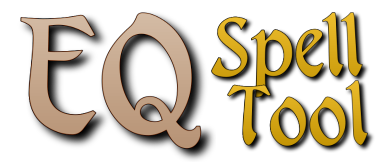

<p align="center"></p>
<p align="center"> A tool to find missing spells for the game <a href="https://www.everquest.com">EverQuest</a>.
</p>
<p align="center"><a href="https://godotengine.org/"></a> <a href="https://github.com/stianfan/EQSpellTool/releases"></a> <a href="https://github.com/stianfan/EQSpellTool/releases"></a>
</p>
<p align="center"> Made with: 
     <a href="https://github.com/BOTLANNER/godot-gif">Godot Gif</a> GDExtension - <a href="https://github.com/source-foundry/Hack">Hack</a> Font - <a href="https://fonticon.github.io/">FontIcon</a> Icons
</p>
     
### What it does:

**TLDR;** Reads txt files outputed to game folder, removes found spells from a list.<br><br>

<br><br>
### How to use:
Select your EverQuest game directory in options. (Should open if no directory is set)<br><br>
Use in-game commands: ``` /output spellbook ``` and ``` /output inventory ```  to export a list of your current characters spellbook, and optionaly your current characters inventory.<br><br>
Select a character in the list. (hit refresh if you made the output after opening the tool)<br>
Then select class, and it will list all the spells of your class not currently scribed in your spellbook.<br><br>

Click the bag icon to also remove any spells if finds in your inventory and bank.
 <br><br>

You can also use the Expansion button under the class icon to filter by expansion. (Saving the selection as default can be toggled in the options.
 

 

